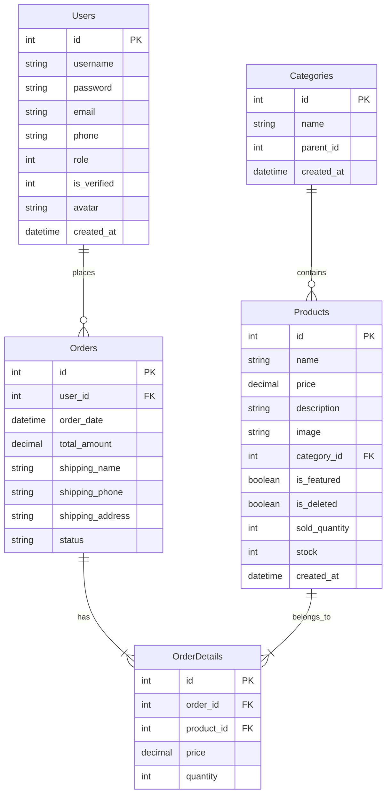

# 📱 TechStore - Hệ Thống Quản Lý & Bán Hàng Công Nghệ

[](https://www.oracle.com/java/)
[](https://jakarta.ee/)
[](https://www.microsoft.com/sql-server/)
[](https://firebase.google.com/)
[](https://tomcat.apache.org/)

Hệ thống **TechStore** là một ứng dụng web thương mại điện tử chuyên nghiệp được xây dựng trên nền tảng **Java Servlet & JSP (Jakarta EE 10)** kết hợp với hệ quản trị cơ sở dữ liệu **Microsoft SQL Server**. Hệ thống hỗ trợ tích hợp phương thức xác thực và bảo mật nâng cao qua **Firebase Authentication** (Google Sign-In, Email Verification, Reset Password).

---

## 📖 Mục Lục
* [Tính Năng Nổi Bật](#-tính-năng-nổi-bật)
* [Công Nghệ Sử Dụng](#-công-ngệ-sử-dụng)
* [Cấu Trúc Thư Mục Dự Án](#-cấu-trúc-thư-mục-dự-án)
* [Hướng Dẫn Cài Đặt](#-hướng-dẫn-cài-đặt)
* [Mô Hình Cơ Sở Dữ Liệu](#-mô-hình-cơ-sở-dữ-liệu)
* [Thông Tin Phân Quyền & Tài Khoản](#-thông-tin-phân-quuyền--tài-khoản)

---

## 🌟 Tính Năng Nổi Bật

### 🧑‍💼 Phân Hệ Khách Hàng (Customer Front-end)
* **Xác Thực Nâng Cao**:
  * Đăng ký tài khoản mới & gửi email xác thực qua Firebase.
  * Đăng nhập chuẩn (mật khẩu) hoặc đăng nhập nhanh bằng **Google (OAuth)** qua Firebase.
  * Tính năng quên mật khẩu & đặt lại mật khẩu bảo mật qua liên kết email.
* **Mua Sắm & Trải Nghiệm**:
  * Xem danh sách sản phẩm theo danh mục, hiển thị sản phẩm nổi bật.
  * Ô tìm kiếm thông minh với chức năng **tự động gợi ý sản phẩm (Auto-suggestion)** theo thời gian thực (realtime JSON API).
  * Chi tiết sản phẩm với thông tin giá, mô tả chi tiết, số lượng tồn kho.
* **Giỏ Hàng & Thanh Toán**:
  * Thêm, sửa số lượng, xóa sản phẩm trong giỏ hàng một cách mượt mà.
  * Quy trình thanh toán (Checkout) tiện lợi, cho phép nhập thông tin giao nhận (Tên, SĐT, Địa chỉ).
  * Lịch sử mua hàng và cập nhật thông tin cá nhân (Profile).

### 👑 Phân Hệ Quản Trị (Admin Dashboard)
* **Báo Cáo & Thống Kê**: Trang Dashboard tổng quan hiển thị doanh thu, đơn hàng và các chỉ số hoạt động.
* **Quản Lý Sản Phẩm & Danh Mục**:
  * Thực hiện các thao tác CRUD (Thêm, Sửa, Xóa mềm) sản phẩm.
  * Cập nhật số lượng tồn kho, giá bán, trạng thái nổi bật, ảnh sản phẩm.
* **Quản Lý Người Dùng**:
  * Xem danh sách tài khoản đăng ký, phân loại theo vai trò (Admin / User) và trạng thái xác minh (Verified).
  * Hỗ trợ vô hiệu hóa / xóa tài khoản người dùng và tự động xử lý các ràng buộc đơn hàng liên quan.
* **Quản Lý Đơn Hàng**:
  * Quản lý danh sách đơn hàng toàn hệ thống.
  * Xem chi tiết đơn hàng (Sản phẩm đã mua, số lượng, đơn giá).
  * Cập nhật trạng thái xử lý đơn hàng (`Pending`, `Processing`, `Completed`, `Cancelled`).

---

## 🛠️ Công Nghệ Sử Dụng

| Thành Phần | Công Nghệ / Thư Viện | Chi Tiết |
| :--- | :--- | :--- |
| **Backend** | Java 17 | JDK 17 (LTS) |
| **Framework / API** | Jakarta EE 10 | Servlet API, JSP (JavaServer Pages) |
| **Database Connector** | Microsoft JDBC Driver 13.2 | `mssql-jdbc-13.2.0.jre11.jar` |
| **Email Service** | Jakarta Mail 2.0 | Gửi & kích hoạt email xác thực tài khoản |
| **Frontend Utilities** | JSTL 2.0 | Xử lý logic hiển thị trên trang JSP |
| **Database** | MS SQL Server | Lưu trữ quan hệ (Users, Products, Orders, Categories) |
| **Authentication** | Firebase SDK | Hỗ trợ Google Sign-In & Firebase Auth Services |
| **Build & Tooling** | Apache Ant / NetBeans | Cấu trúc và triển khai dự án tự động |

---

## 📁 Cấu Trúc Thư Mục Dự Án

```text
TechStore/
├── allowedlib/             # Thư viện dependencies (.jar) của dự án
├── database/               # Thư mục lưu trữ database script
│   └── TechStore.sql       # Script tạo cấu trúc database SQL Server
├── src/java/               # Mã nguồn Java chính (Backend)
│   ├── controller/         # Các Servlets xử lý luồng yêu cầu từ Client
│   │   ├── Admin/          # Servlets quản lý các chức năng Admin
│   │   └── ...             # Các Servlets chức năng của Khách hàng
│   ├── dao/                # Data Access Objects (Thực thi truy vấn SQL qua JDBC)
│   │   └── DBContext.java  # Lớp cấu hình kết nối SQL Server
│   └── model/              # Các đối tượng thực thể (User, Product, Order,...)
├── web/                    # Giao diện ứng dụng (Frontend)
│   ├── css/                # Định dạng kiểu dáng (style.css)
│   ├── images/             # Tài nguyên hình ảnh tĩnh
│   ├── WEB-INF/            # Cấu hình servlet & web.xml định nghĩa deploy descriptor
│   └── *.jsp               # Các trang giao diện JSP (index, cart, checkout, profile,...)
├── DBMigration.java        # File hỗ trợ tự động kiểm tra/nâng cấp bảng DB
└── build.xml               # File cấu hình build Ant cho IDE NetBeans
```

---

## 🚀 Hướng Dẫn Cài Đặt

### 1. Yêu Cầu Hệ Thống (Prerequisites)
* **Java Development Kit (JDK)**: Phiên bản **17** trở lên.
* **Database**: **Microsoft SQL Server** (đã bật chế độ xác thực SQL Server và tài khoản `sa`).
* **Web Server**: **Apache Tomcat 10.x** (tương thích Jakarta EE).
* **IDE**: Khuyên dùng **NetBeans IDE** (hoặc IntelliJ IDEA Ultimate có hỗ trợ Tomcat).

### 2. Thiết Lập Cơ Sở Dữ Liệu
1. Mở công cụ quản lý cơ sở dữ liệu (ví dụ: *SQL Server Management Studio - SSMS*).
2. Mở file [TechStore.sql](file:///d:/Code/SaleWeb/TechStore/database/TechStore.sql) và nhấn **Execute (F5)** để khởi tạo Database `TechStore` cùng các bảng cần thiết.
3. Mở file cấu hình kết nối cơ sở dữ liệu tại [DBContext.java](file:///d:/Code/SaleWeb/TechStore/src/java/dao/DBContext.java):
   ```java
   String url = "jdbc:sqlserver://localhost:1433;databaseName=TechStore;encrypt=false";
   String user = "sa"; // Tài khoản SQL Server của bạn
   String pass = "123456"; // Mật khẩu tài khoản
   ```
   *Lưu ý:* Thực hiện cấu hình tương tự trong file [DBMigration.java](file:///d:/Code/SaleWeb/TechStore/DBMigration.java) nếu bạn muốn dùng công cụ Migration này.

### 3. Cấu Hình Firebase Authentication (Dành cho chức năng Google Login / Reset Pass)
Hệ thống sử dụng Firebase Client SDK để thực hiện đăng nhập Google và xác minh email. Để tính năng này hoạt động đúng tài khoản của bạn:
1. Truy cập [Firebase Console](https://console.firebase.google.com/) và tạo một dự án mới.
2. Bật dịch vụ **Authentication**, kích hoạt các phương thức: **Email/Password** và **Google**.
3. Lấy thông tin **Web App Firebase Config** và thay thế cấu hình tại file [login.jsp](file:///d:/Code/SaleWeb/TechStore/web/login.jsp) (khoảng dòng 87-95):
   ```javascript
   const firebaseConfig = {
       apiKey: "YOUR_API_KEY",
       authDomain: "YOUR_PROJECT_ID.firebaseapp.com",
       projectId: "YOUR_PROJECT_ID",
       storageBucket: "YOUR_PROJECT_ID.firebasestorage.app",
       messagingSenderId: "YOUR_SENDER_ID",
       appId: "YOUR_APP_ID"
   };
   ```

### 4. Triển Khai & Khởi Chạy ứng Dụng
1. Mở **NetBeans IDE** -> Chọn **Open Project** -> Chọn thư mục `TechStore`.
2. Kiểm tra thư viện trong NetBeans: Nếu báo thiếu thư viện, hãy add toàn bộ các file `.jar` nằm trong thư mục [allowedlib/](file:///d:/Code/SaleWeb/TechStore/allowedlib) vào mục **Libraries** của Project.
3. Nhấp chuột phải vào dự án -> Chọn **Clean and Build**.
4. Nhấp chuột phải -> Chọn **Run** để khởi chạy Tomcat Server. Trình duyệt sẽ tự động mở trang chủ tại địa chỉ mặc định:
   ```text
   http://localhost:8080/TechStore/
   ```

---

## 📊 Mô Hình Cơ Sở Dữ Liệu

Cơ sở dữ liệu gồm 5 bảng chính liên kết chặt chẽ với nhau:
* `Users`: Lưu trữ thông tin tài khoản khách hàng và admin (Phân quyền bằng cột `role`: `1` - Admin, `0` - User).
* `Categories`: Các danh mục sản phẩm (Hỗ trợ cấu trúc phân cấp danh mục qua `parent_id`).
* `Products`: Lưu trữ thông tin chi tiết sản phẩm, giá bán, số lượng tồn kho và trạng thái xóa mềm (`is_deleted`).
* `Orders`: Đơn hàng do khách hàng khởi tạo cùng thông tin giao hàng và tổng số tiền thanh toán.
* `OrderDetails`: Chi tiết từng mặt hàng và số lượng tương ứng của mỗi đơn đặt hàng.



---

## 🔑 Thông Tin Phân Quyền & Tài Khoản

* **Đăng ký người dùng thường (Customer)**: Mọi tài khoản mới được đăng ký qua form `register.jsp` đều mặc định có quyền `role = 0`. Khách hàng cần nhấp vào liên kết xác minh được gửi từ Firebase đến email đăng ký để đổi trạng thái `is_verified = 1` trước khi đăng nhập.
* **Tạo tài khoản quản trị (Admin)**:
  1. Thực hiện Đăng ký tài khoản thường trước qua giao diện.
  2. Truy cập vào cơ sở dữ liệu SQL Server của bạn và chạy truy vấn sau để cấp quyền Admin (`role = 1`):
     ```sql
     UPDATE Users SET role = 1, is_verified = 1 WHERE username = 'ten_tai_khoan_cua_ban';
     ```
  3. Đăng nhập lại để truy cập khu vực `/admin_dashboard.jsp` của Admin.
