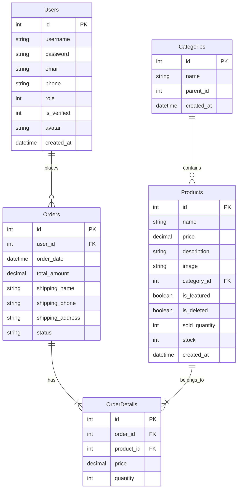

# 📱 TechStore - Technology Management & Sales System

[](https://www.oracle.com/java/)
[](https://jakarta.ee/)
[](https://www.microsoft.com/sql-server/)
[](https://firebase.google.com/)
[](https://tomcat.apache.org/)

The **TechStore** system is a professional e-commerce web application built on the **Java Servlet & JSP (Jakarta EE 10)** platform, integrated with the **Microsoft SQL Server** database management system. The system supports advanced authentication and security integration via **Firebase Authentication** (Google Sign-In, Email Verification, Reset Password).

---

## 📖 Table of Contents
* [Key Features](#-key-features)
* [Technologies Used](#-technologies-used)
* [Project Directory Structure](#-project-directory-structure)
* [Installation Guide](#-installation-guide)
* [Database Model](#-database-model)
* [Authorization & Account Information](#-authorization--account-information)

---

## 🌟 Key Features

### 🧑‍💼 Customer Front-end (Customer Front-end)
* **Advanced Authentication**:
  * New account registration & verification email sent via Firebase.
  * Standard login (password) or quick login with **Google (OAuth)** via Firebase.
  * Password recovery & secure reset features via email link.
* **Shopping & Experience**:
  * Browse product list by category, displaying featured products.
  * Smart search box with real-time **product auto-suggestion** (realtime JSON API).
  * Product details page displaying price, detailed description, and stock quantity.
* **Cart & Checkout**:
  * Seamlessly add, update quantity, and remove products in the cart.
  * Convenient Checkout process, allowing input of shipping information (Name, Phone, Address).
  * Purchase history and personal profile updates.

### 👑 Admin Dashboard (Admin Dashboard)
* **Reporting & Statistics**: Overview Dashboard displaying revenue, orders, and key performance metrics.
* **Product & Category Management**:
  * Complete CRUD (Create, Read, Update, Soft Delete) operations for products.
  * Update inventory stock, pricing, featured status, and product images.
* **User Management**:
  * View list of registered accounts, classified by role (Admin / User) and verification status (Verified).
  * Support disabling/deleting user accounts and automatically handling related order constraints.
* **Order Management**:
  * Manage the system-wide list of orders.
  * View order details (purchased products, quantity, unit price).
  * Update order status (`Pending`, `Processing`, `Completed`, `Cancelled`).

---

## 🛠️ Technologies Used

| Component | Technology / Library | Details |
| :--- | :--- | :--- |
| **Backend** | Java 17 | JDK 17 (LTS) |
| **Framework / API** | Jakarta EE 10 | Servlet API, JSP (JavaServer Pages) |
| **Database Connector** | Microsoft JDBC Driver 13.2 | `mssql-jdbc-13.2.0.jre11.jar` |
| **Email Service** | Jakarta Mail 2.0 | Sending & activating account verification emails |
| **Frontend Utilities** | JSTL 2.0 | Handling display logic on JSP pages |
| **Database** | MS SQL Server | Relational storage (Users, Products, Orders, Categories) |
| **Authentication** | Firebase SDK | Supporting Google Sign-In & Firebase Auth Services |
| **Build & Tooling** | Apache Ant / NetBeans | Automatic project build and deployment |

---

## 📁 Project Directory Structure

```text
TechStore/
├── allowedlib/             # Project dependency libraries (.jar)
├── database/               # Database script storage directory
│   └── TechStore.sql       # Script to generate SQL Server database structure
├── src/java/               # Main Java source code (Backend)
│   ├── controller/         # Servlets handling request flows from Client
│   │   ├── Admin/          # Servlets managing Admin functionalities
│   │   └── ...             # Client-facing feature Servlets
│   ├── dao/                # Data Access Objects (Executing SQL queries via JDBC)
│   │   └── DBContext.java  # SQL Server connection configuration class
│   └── model/              # Entity objects (User, Product, Order, etc.)
├── web/                    # Application user interface (Frontend)
│   ├── css/                # Styling files (style.css)
│   ├── images/             # Static image assets
│   ├── WEB-INF/            # Servlet configuration & web.xml deployment descriptor
│   └── *.jsp               # JSP interface pages (index, cart, checkout, profile, etc.)
├── DBMigration.java        # DB tables auto-verification/upgrade helper file
└── build.xml               # Ant build configuration file for NetBeans IDE
```

---

## 🚀 Installation Guide

### 1. Prerequisites
* **Java Development Kit (JDK)**: Version **17** or higher.
* **Database**: **Microsoft SQL Server** (SQL Server authentication mode and `sa` account enabled).
* **Web Server**: **Apache Tomcat 10.x** (compatible with Jakarta EE).
* **IDE**: Recommended **NetBeans IDE** (or IntelliJ IDEA Ultimate with Tomcat support).

### 2. Database Setup
1. Open your database management tool (e.g., *SQL Server Management Studio - SSMS*).
2. Open the file [TechStore.sql](file:///d:/Code/SaleWeb/TechStore/database/TechStore.sql) and press **Execute (F5)** to initialize the `TechStore` database and its required tables.
3. Open the database connection configuration file at [DBContext.java](file:///d:/Code/SaleWeb/TechStore/src/java/dao/DBContext.java):
   ```java
   String url = "jdbc:sqlserver://localhost:1433;databaseName=TechStore;encrypt=false";
   String user = "sa"; // Your SQL Server username
   String pass = "123456"; // Your SQL Server password
   ```
   *Note:* Apply the same configuration in the [DBMigration.java](file:///d:/Code/SaleWeb/TechStore/DBMigration.java) file if you wish to use this migration tool.

### 3. Firebase Authentication Setup (For Google Login / Reset Password)
The system uses the Firebase Client SDK to perform Google login and email verification. To configure this for your own account:
1. Go to the [Firebase Console](https://console.firebase.google.com/) and create a new project.
2. Enable the **Authentication** service, and activate the following sign-in methods: **Email/Password** and **Google**.
3. Obtain the **Web App Firebase Config** and replace the configuration details in [login.jsp](file:///d:/Code/SaleWeb/TechStore/web/login.jsp) (around lines 87-95):
   ```javascript
   const firebaseConfig = {
       apiKey: "YOUR_API_KEY",
       authDomain: "YOUR_PROJECT_ID.firebaseapp.com",
       projectId: "YOUR_PROJECT_ID",
       storageBucket: "YOUR_PROJECT_ID.firebasestorage.app",
       messagingSenderId: "YOUR_SENDER_ID",
       appId: "YOUR_APP_ID"
   };
   ```

### 4. Deployment & Running the Application
1. Open **NetBeans IDE** -> Select **Open Project** -> Select the `TechStore` folder.
2. Verify libraries in NetBeans: If any library is missing, add all the `.jar` files in the [allowedlib/](file:///d:/Code/SaleWeb/TechStore/allowedlib) directory to the Project's **Libraries** section.
3. Right-click on the project -> Select **Clean and Build**.
4. Right-click -> Select **Run** to launch the Tomcat Server. The browser will automatically open the homepage at the default URL:
   ```text
   http://localhost:8080/TechStore/
   ```

---

## 📊 Database Model

The database consists of 5 main tables tightly coupled with each other:
* `Users`: Stores customer and admin account information (Role-based access control via the `role` column: `1` for Admin, `0` for User).
* `Categories`: Product categories (Supports hierarchical structure via `parent_id`).
* `Products`: Stores detailed product information, price, inventory stock quantity, and soft-delete status (`is_deleted`).
* `Orders`: Orders created by customers, containing shipping details and total payment amount.
* `OrderDetails`: Specific itemized items and quantities corresponding to each order.



---

## 🔑 Authorization & Account Information

* **Customer Registration**: Any new account registered via the `register.jsp` form defaults to `role = 0`. Customers must click the verification link sent from Firebase to their registered email to change their status to `is_verified = 1` before they can log in.
* **Creating an Admin Account**:
  1. Register a regular customer account first through the website interface.
  2. Access your SQL Server database and execute the following query to grant Admin privileges (`role = 1`):
     ```sql
     UPDATE Users SET role = 1, is_verified = 1 WHERE username = 'your_username';
     ```
  3. Log in again to access the Admin panel at `/admin_dashboard.jsp`.
